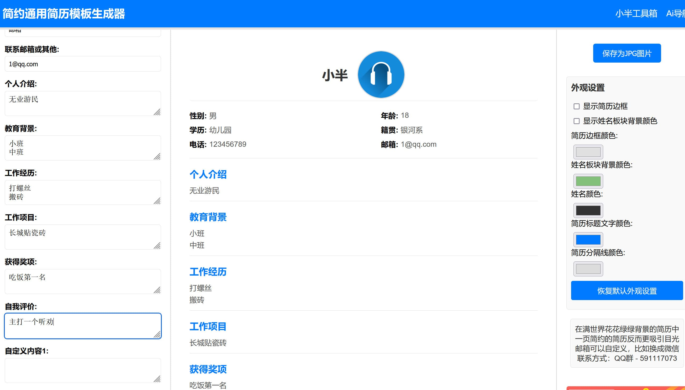

已经有非常多很优秀的简历模板生成器了，只是我想要一个特别简单的，不管是安装还是用户使用，都非常便捷的，所以这个就出来了。

产品功能： 

常规简历信息添加 
自定义部分外观颜色 
导出为JPG图片 
可以在左侧添加简历信息 
也可以直接在中间的简历模板进行编辑 
加了2个自定义简历内容板块 

产品文件： 

index.php （首页） 
template.php（简历预览） 
js/script.js、js/html2canvas.min.js（导出为图片用的库） 
css/style.css 

非常简单，对于要自己使用的网站站长来说，部署简单，放你网站上直接就能用，对于用户来说也很直观，填表就行。

没有后台功能，把文件下载下来，修改相关的关键词，图片链接就行了。

